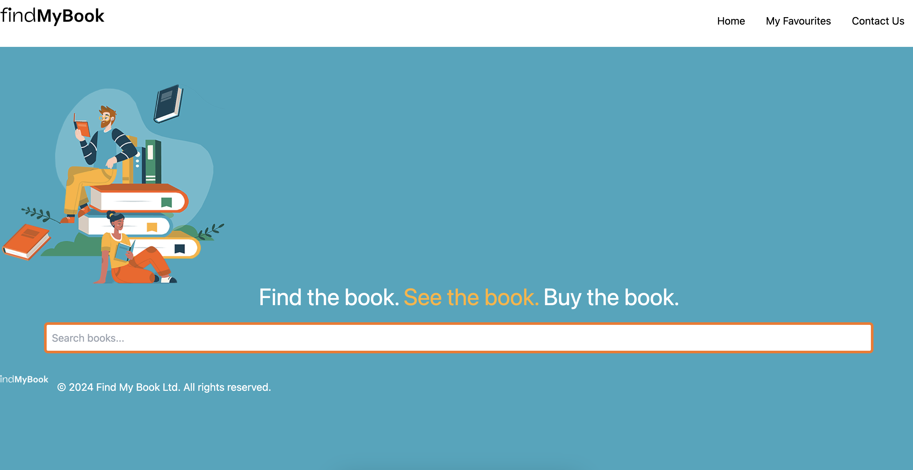

[![Contributors][contributors-shield]][contributors-url]
[![Forks][forks-shield]][forks-url]
[![Stargazers][stars-shield]][stars-url]
[![Issues][issues-shield]][issues-url]
[![MIT License][license-shield]][license-url]

 

  
  

   Find the book. See the book. Buy the book.
     
    <a href="https://github.com/rhipsime/thebookclub"><strong>Explore the docs »</strong></a>
     
     
    <a href="https://findmy-book.netlify.app/">View Demo</a>
    ·
    <a href="https://github.com/rhipsime/thebookclub/issues">Report Bug</a>
    ·
    <a href="https://github.com/rhipsime/thebookclub/issues">Request Feature</a>
  

<!-- TABLE OF CONTENTS -->

  
Table of Contents

  <ol>
    <li>
      <a href="#about-the-project">About The Project</a>
      <ul>
        <li><a href="#built-with">Built With</a></li>
      </ul>
    </li>
    <li>
      <a href="#getting-started">Getting Started</a>
      <ul>
        <li><a href="#prerequisites">Prerequisites</a></li>
        <li><a href="#installation">Installation</a></li>
      </ul>
    </li>
    <li><a href="#usage">Usage</a></li>
    <li><a href="#roadmap">Roadmap</a></li>
    <li><a href="#contributing">Contributing</a></li>
    <li><a href="#license">License</a></li>
    <li><a href="#contact">Contact</a></li>
    <li><a href="#acknowledgments">Acknowledgments</a></li>
  </ol>

<!-- ABOUT THE PROJECT -->
## About The Project

This website leverages the Google Books API to enable users to search for books, providing a seamless experience for discovering literature. Upon selecting a book, users are redirected to Amazon, where they can directly purchase the selected title. The integration with Google Books API allows for efficient book search functionality, utilising Google's vast database of books to provide users with a wide range of options. The transition to Amazon for purchasing ensures a secure and straightforward checkout process, leveraging Amazon's established payment and delivery infrastructure. This combination of technologies creates a user-friendly platform for book discovery and purchase, offering a convenient solution for both book lovers and e-commerce enthusiasts.

Benefits of using the site:
* Users can search through a vast database of books, making it easier to find the perfect read.
* Users can directly purchase their selected books from Amazon, benefiting from its established payment and delivery infrastructure.
* The site gives users the ability to store books as favorites.

## User Story

As a user, I want to be able to search for books by author, genre, subject, or a single keyword. User should be able to click a favourite button to store for later viewing or show a ‘Buy’ button that directs me to Amazon.

## Acceptance Criteria

Create a book search system with form inputs:
* When a user searches for a book they are presented with personalised book recommendations based on their search criteria.
* When a user can click a link to purchase the book through an Amazon link.

## Usage

After installing the project, open the application in your web browser and navigate to (https://findmy-book.netlify.app/). Here, you can enter the name of a book, author or keyword using the search bar, browse through the results. Click on a book to store as favourites and access buying options through an Amazon link.

## Features
* Search Functionality: Users can search for books by author, genre, subject, or a single keyword.
* Users can save the favourite books + 
* Sorting Options: Results can be sorted by author, genre, or rating.
* Recommendations: The system provides book recommendations based on the user's search criteria 
* Book Access: Users can purchase the book through an Amazon link.

(<a href="#readme-top">back to top</a>)

## Screenshots

Main Page

Book Search feature

(<a href="#readme-top">back to top</a>)

## Built With

Technologies Used
* Frontend: React + Tailwind CSS

* Backend: Node.JS

* APIs: Google Books API

* Development Tools: Vite + Github 

* Deployment: Netlify 

* Packages: React Hook Form, Context API

(<a href="#readme-top">back to top</a>)

<!-- CONTRIBUTING -->
## Contributors
 
* Nadia 
* Kashfee
* Shahreen
* Arie
* Csaba

(<a href="#readme-top">back to top</a>)

<!-- LICENSE -->
## License

Distributed under the MIT License. See `LICENSE.txt` for more information.

<!-- MARKDOWN LINKS & IMAGES -->
<!-- https://www.markdownguide.org/basic-syntax/#reference-style-links -->
[contributors-shield]: https://img.shields.io/github/contributors/rhipsime/thebookclub.svg?style=for-the-badge
[contributors-url]: https://github.com/rhipsime/thebookclub/graphs/contributors
[forks-shield]: https://img.shields.io/github/forks/rhipsime/thebookclub.svg?style=for-the-badge
[forks-url]: https://github.com/rhipsime/thebookclub/network/members
[stars-shield]: https://img.shields.io/github/stars/rhipsime/thebookclub.svg?style=for-the-badge
[stars-url]: https://github.com/rhipsime/thebookclub/stargazers
[issues-shield]: https://img.shields.io/github/issues/rhipsime/thebookclub.svg?style=for-the-badge
[issues-url]: https://github.com/rhipsime/thebookclub/issues
[license-shield]: https://img.shields.io/github/license/rhipsime/thebookclub.svg?style=for-the-badge
[license-url]: https://github.com/rhipsime/thebookclub/blob/master/LICENSE.txt
[linkedin-shield]: https://img.shields.io/badge/-LinkedIn-black.svg?style=for-the-badge&logo=linkedin&colorB=555
[linkedin-url]: https://linkedin.com/in/othneildrew
[product-screenshot]: images/screenshot.png
[Next.js]: https://img.shields.io/badge/next.js-000000?style=for-the-badge&logo=nextdotjs&logoColor=white
[Next-url]: https://nextjs.org/
[React.js]: https://img.shields.io/badge/React-20232A?style=for-the-badge&logo=react&logoColor=61DAFB
[React-url]: https://reactjs.org/
[Vue.js]: https://img.shields.io/badge/Vue.js-35495E?style=for-the-badge&logo=vuedotjs&logoColor=4FC08D
[Vue-url]: https://vuejs.org/
[Angular.io]: https://img.shields.io/badge/Angular-DD0031?style=for-the-badge&logo=angular&logoColor=white
[Angular-url]: https://angular.io/
[Svelte.dev]: https://img.shields.io/badge/Svelte-4A4A55?style=for-the-badge&logo=svelte&logoColor=FF3E00
[Svelte-url]: https://svelte.dev/
[Laravel.com]: https://img.shields.io/badge/Laravel-FF2D20?style=for-the-badge&logo=laravel&logoColor=white
[Laravel-url]: https://laravel.com
[Bootstrap.com]: https://img.shields.io/badge/Bootstrap-563D7C?style=for-the-badge&logo=bootstrap&logoColor=white
[Bootstrap-url]: https://getbootstrap.com
[JQuery.com]: https://img.shields.io/badge/jQuery-0769AD?style=for-the-badge&logo=jquery&logoColor=white
[JQuery-url]: https://jquery.com 

# React + Vite

This template provides a minimal setup to get React working in Vite with HMR and some ESLint rules.

Currently, two official plugins are available:

- [@vitejs/plugin-react](https://github.com/vitejs/vite-plugin-react/blob/main/packages/plugin-react/README.md) uses [Babel](https://babeljs.io/) for Fast Refresh
- [@vitejs/plugin-react-swc](https://github.com/vitejs/vite-plugin-react-swc) uses [SWC](https://swc.rs/) for Fast Refresh
